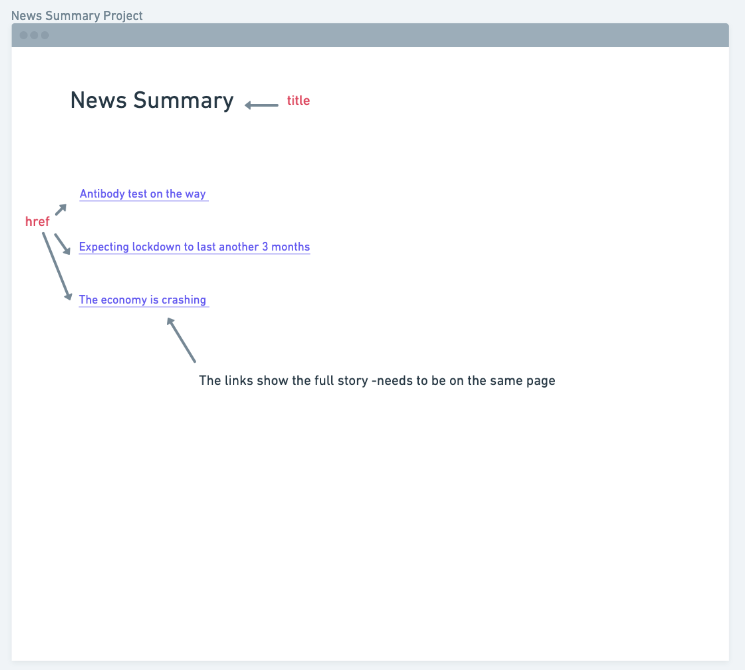
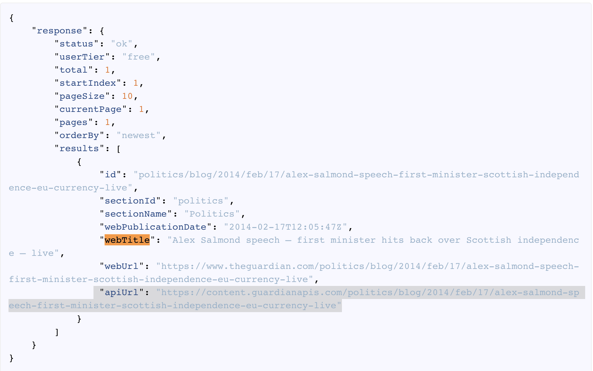
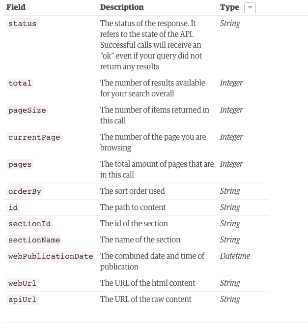

# Goals

- Focus on process
  - Planning
    - [x] organising user stories
    - [ ] Breakdown user stories
    - [ ] checklists
    - [ ] diagraming & tables
  - Refractoring
    - [ ] Methods broken down
    - [ ] Classes
    - [ ] Names
    - [ ] public/ private
  - TDD
    - [ ] commit Red, Green, Refractor
    - [ ] Test first
    - [ ] Use console
  - Documentation
    - [ ] Document learning by writing notes
    - [ ] Document process

## Frontend, single page app guidance

- How will you serve your app?

- How will you write and run unit tests?
- Maybe you won't write any feature tests. If you do, how will you do it?

- How will you intercept form submissions so they don't reload the page? `form submit event` and `preventDefault` may prove useful.

- How will you intercept URL changes so that they don't reload the page?

- How will you implement the domain model?

- How will you construct your HTML content? You could write a view module. Maybe it will concatenate strings? Maybe it will use a tiny tiny templating framework that you write.

- How will you map URLs to resources? How will you render HTML to the page? How will you let your HTML interface interact with your models in a clean way? Maybe a controller or two?

- How will you make requests to external APIs? Maybe Ajax with raw XMLHttpRequest objects?

---

- [x] Organise user stories based on priority
- [x] Basic mock up sketch with HTML elements
- [x] Research server for app
- [x] Add server
- [x] Decide on testing
- [x] Research requests to external API's
- [x] User Story - headlines
- [x] User Story - link to news article on guardian website
- [ ] User Story - summary

## Organise user stories based on piority & ease of implementation


(organised in order, yellow tag = mvp )

## Basic mock up sketch with HTML elements



## Testing - I am going to complete this project with Jasmine & come back

## Research requests to external API's

<https://open-platform.theguardian.com/documentation/>

-taken from makers README.md for the project

### API Overview

The basic idea is to send an `apiRequestUrl` query parameter to the News Summary API. The value of this parameter is the URL of the request you _would_ have made to the Guardian or Aylien API, minus any API credentials.

### Guardian API example

**Please stub your tests to avoid exceeding the API rate limit**

If you wanted to get the content of an article from the Guardian API, this is the cURL request you might make.

```
curl "http://content.guardianapis.com/politics/blog/2014/feb/17/alex-salmond-speech-first-minister-scottish-independence-eu-currency-live?show-fields=body&api-key=SECRET_API_KEY"
```

- parameters: body & `api-key`

To make this request via the Makers News Summary API with cURL, you could do something like this:

```
curl "http://news-summary-api.herokuapp.com/guardian?apiRequestUrl=http://content.guardianapis.com/politics/blog/2014/feb/17/alex-salmond-speech-first-minister-scottish-independence-eu-currency-live?show-fields=body"

```

- http://news-summary-api.herokuapp.com/guardian?apiRequestUrl=
- parameter value: http://content.guardianapis.com/politics/blog/2014/feb/17/alex-salmond-speech-first-minister-scottish-independence-eu-currency-live?show-fields=body"

- parameters only body, no `api-key`

Note how the `apiRequestUrl` parameter value is just the request you would have made to the Guardian API, minus `api-key`.

## Decide on testing

- going to start with Jasmine as want to focus on process and refractoring and my testing framework at the moment needs updating, I will come back to this challenge and use my own testing framework
- Feature tests are manual tests with checklists

### What is the user doing with the data?

- **Views** headlines
- **Selects** headlines
- **Views** story

--> user does NOT need access to functions when viewing - methods can be **private**
--> user does need access to function when selecting - methods must be **public**

| User                             | DOM                  | HTML                                                         | api              |
| -------------------------------- | -------------------- | ------------------------------------------------------------ | ---------------- |
| views headlines                  | on load sets up page | headline container                                           | guardian - title |
| click on link for guardian story | on load sets up page | headline container                                           | guardian - link  |
| click on headlines for summary   | listen to user?      | change to summary containter <br> headline container removed | Aylien link      |
|                                  |                      |                                                              |                  |

# User stories

```
1.  As a busy politician
    I can see all of today's headlines in one place
    So I know what the big stories of the day are
```

```
2.  As a busy politician
    I can click a link to see the original news article
    So that I can get an in depth understanding of a very important story
```

**Feature Test 1**: User story 1

- [x] User can see headlines from guardian
- [x] User can see headlines printed as a list

Steps:

- [x] Create html with headline container
- [x] Get API working
- [x] Add to headline container - interface
- [x] Print to html as a list

# Research - API

### relates to feature test 1

## Guardian API research and experimentation


<https://open-platform.theguardian.com/documentation/search>

```javascript
results = parsedResponse.response.results;
```


- array with objects
- Can access objects with keys
- need webTitle



---

**Feature Test 2**: User Story 2

- [ ] User can click on link
- [ ] Link will show full story

- Steps
- [x] Add href
- [x] research how to access content of article
- [x] link to guardian website
- [x] Find solution to bug - only showing some links

## Research

**href**:


- href is the link
- text is between tags

**How to access content**:

- Test with `webUrl` (The URL of the html content) √
- `apiUrl` - The URL of the raw content
  - {"message":"No API key found in request"}
  - "apiUrl": "https://content.guardianapis.com/politics/blog/2014/feb/17/alex-salmond-speech-first-minister-scottish-independence-eu-currency-live"

## bug

```javascript
// missed out on single quotes between  interpolated javascript
headLineList.innerHTML += `<a href='${result.webTitle}>${result.webTitle}'</a>`;
headLineList.innerHTML += `<a href='${result.webTitle}'>'${result.webTitle}'</a>`;
```

---

```
3.  As a busy politician
    I can see a summary of a news article
    So I can get a few more details about an important story
```

**Feature Test 2**: User Story 3

| USER                           | DOM             | HTML                                                         | API         |
| ------------------------------ | --------------- | ------------------------------------------------------------ | ----------- |
| click on headlines for summary | listen to user? | change to summary containter <br> headline container removed | Aylien link |

- [ ] User can click on on the headlines
- [ ] Headlines will show only the content of the article on the same page

### Steps

API
- [x] Research Aylien summary API
- [x] Get the parameter value for url and save it to a variable
- [ ] Request, open + send Aylien API request
- [ ] turn json into javascript
  
  HTML 
- [X] Research best html elements to show new content on one page apps
- [X] Make the headlines clickable
- [X] Display test content on the same page
- [X] Delete all other content
- [X] Bring back all other content

Connected 
- [ ] Display content of the article

---

## Research - Aylien summary API

**Aylien API**

```
curl "https://api.aylien.com/api/v1/summarize?url=http://worrydream.com/MediaForThinkingTheUnthinkable/note.html" \
  -H "X-AYLIEN-TextAPI-Application-ID: APPLICATION_ID" \
  -H "X-AYLIEN-TextAPI-Application-Key: SECRET_APPLICATION_KEY"
```

- Uses headers to authenticate with the Aylien API.

**Makers News Summary API with cURL**

```
curl "http://news-summary-api.herokuapp.com/aylien?apiRequestUrl=https://api.aylien.com/api/v1/summarize?url=http://worrydream.com/MediaForThinkingTheUnthinkable/note.html"
```

- herokuapp
  - http://news-summary-api.herokuapp.com/aylien?apiRequestUrl=
- **parameter value of herokuapp** - api request --> aylien api
  - https://api.aylien.com/api/v1/summarize?url=
- **Parameter value ** - url to summarise

  - http://worrydream.com/MediaForThinkingTheUnthinkable/note.html

- same request to the Aylien API but no authentication headers

---
## Research -  Research best html elements to show new content on one page apps
- Experiment with a ```button``` & if it does not work will try ```href```
  
  ``` html
  <input id="submit-note" onclick="showEntireNore(event)" type="submit" value="Make note">
  ```

  ``` javascript
  function showEntireNote() {
  let noteAddress = findNoteAddress();
  let index = findIndexOfNoteClicked(noteAddress);
  displayNoteView(index);
  hideNotesListView();
}
```


**Buttons: **

```javascript
document.getElementById("individual-note-view").style.display = "none";
populateNoteList();
window.addEventListener("hashchange", showEntireNote);
```

Problem - in populateHeadlist  added button with function 
```javascript
    headLineList.innerHTML += `<button  id='headline-button' type='button' onclick='${displaySummary()}'> ${result.webTitle}  </button> <br>`
```
- but runs method method so it is 'clicking' without being clicked 


Need to experiment with buttons more:
- **Experiment 1:**
- put in html before script is called - this now only runs when clicked but only one button as it not created with  for loop  

```html
 <button  id='headline-button' type='button' onclick=displaySummary()>   </button> <br>
 ```

 **Research**
 - Research lead me to addEventListener method 

<https://developer.mozilla.org/en-US/docs/Web/API/EventTarget/addEventListener>
<https://www.w3schools.com/jsref/event_onclick.asp>

```javascript
object.addEventListener("click", myscript)

```


- tried this method but it only worked for first headline 
- I then tried examples from here which are meant to add multiple event handlers <https://flaviocopes.com/how-to-add-event-listener-multiple-elements-javascript/>
- But also only worked for first headline 
  
- Then went back and looked at what Thomas had done for our notes-app project. This worked   √   
  - /Users/ginafrankel/Projects/group/notes-app
  - branch - toms-super-amazing-branch)  
  - interface.js - line 32
  - index.html - line 13
  - 
``` javascript
testList.innerHTML += `<a onclick="viewNote('${index}','${notes.fullList}')" id='${note}'>${note}<br></a>`;
```
- <a></a>  - anchor element 
- onclick=viewNote() - runs a the function viewNote on click 

I thought this needed a href to work but it seems to work with just onclick 
- does it ned an <a></a>
- maybe it will work with any element -- test  √ works with <p></p>
- Looking at my notes above I  realised I had tried something very similar 

```javascript
    headLineList.innerHTML += `<button  id='headline-button' type='button' onclick='${displaySummary()}'> ${result.webTitle}  </button> <br>`
```
- but the problem was I had passed the displaySummary as javascript not html and thus it ran the method 


## Ideation: Bring back all other content

- button 
  - created a button which  onclick  #goBack executes
  - #goBack uses #location.reload which reloads the page

--------------------------------------------------------------------------------