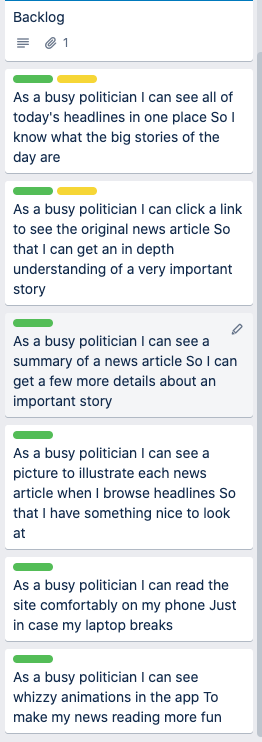

# Frontend, single page app guidance

- How will you serve your app?

- How will you write and run unit tests?
- Maybe you won't write any feature tests. If you do, how will you do it?

- How will you intercept form submissions so they don't reload the page? `form submit event` and `preventDefault` may prove useful.

- How will you intercept URL changes so that they don't reload the page?

- How will you implement the domain model?

- How will you construct your HTML content? You could write a view module. Maybe it will concatenate strings? Maybe it will use a tiny tiny templating framework that you write.

- How will you map URLs to resources? How will you render HTML to the page? How will you let your HTML interface interact with your models in a clean way? Maybe a controller or two?

- How will you make requests to external APIs? Maybe Ajax with raw XMLHttpRequest objects?

---

- [x] Organise user stories based on priority
- [x] Basic mock up sketch with HTML elements
- [x] Research server for app
- [x] Add server
- [ ] Decide on testing
- [x] Research requests to external API's
- [ ] User stories - headlines

## Organise user stories based on piority


(organised in order, yellow tag = mvp )

## Basic mock up sketch with HTML elements


## Testing - I am going to complete this project with Jasmine & come back

## Research requests to external API's

<https://open-platform.theguardian.com/documentation/>

-taken from makers README.md for the project

### API Overview

The basic idea is to send an `apiRequestUrl` query parameter to the News Summary API. The value of this parameter is the URL of the request you _would_ have made to the Guardian or Aylien API, minus any API credentials.

### Guardian API example

**Please stub your tests to avoid exceeding the API rate limit**

If you wanted to get the content of an article from the Guardian API, this is the cURL request you might make. Notice how it has a query parameter for `api-key`.

```
curl "http://content.guardianapis.com/politics/blog/2014/feb/17/alex-salmond-speech-first-minister-scottish-independence-eu-currency-live?show-fields=body&api-key=SECRET_API_KEY"
```

To make this request via the Makers News Summary API with cURL, you could do something like this:

```
curl "http://news-summary-api.herokuapp.com/guardian?apiRequestUrl=http://content.guardianapis.com/politics/blog/2014/feb/17/alex-salmond-speech-first-minister-scottish-independence-eu-currency-live?show-fields=body"
```

Note how the `apiRequestUrl` parameter value is just the request you would have made to the Guardian API, minus `api-key`.

## User journey

- user reads titles
- user clicks on title link and it shows the full story

## User stories

```
1.  As a busy politician
    I can see all of today's headlines in one place
    So I know what the big stories of the day are
```

```
2.  As a busy politician
    I can click a link to see the original news article
    So that I can get an in depth understanding of a very important story
```

What is the user doing with the data?

- View headlines 
- Selects headlines 
- Views story
  
--> user does NOT need access to functions when viewing - methods can be **private**
--> user does need access to function when selecting - methods must be **public**


| User               | DOM                                | HTML            | Guardian api |
| ------------------ | ---------------------------------- | --------------- | ------------ |
| views headlines    | X                                  | X               | titles       |
| click on headlines | Listen for click -> Select link id | change to story | full story   |
|                    |                                    |                 |              |
